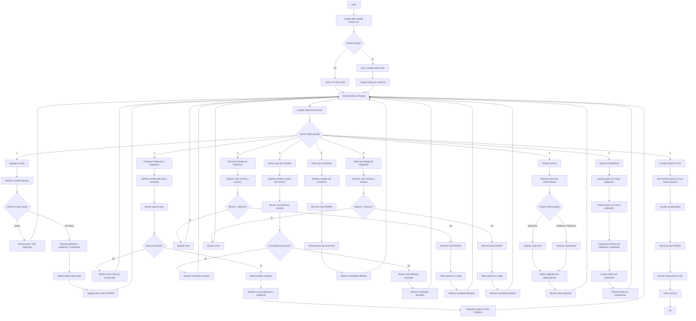

# Trabajo Practico Integrador - UTN - Facultad Regional San Nicolas


# Sistema de Gestión de Datos de Países

## Descripción del Programa

Este programa es un sistema de gestión de datos de países desarrollado en Python que permite almacenar, consultar, modificar y analizar información sobre países del mundo. El sistema utiliza un archivo CSV (`paises.csv`) para la persistencia de datos, permitiendo que la información se mantenga durante toda la ejecucion del programa.

### Funcionalidades Principales

- **Gestión de Datos**: Agregar nuevos países y actualizar información existente
- **Búsqueda**: Buscar países por nombre (búsqueda exacta o parcial)
- **Filtrado**: Filtrar países por continente o por rangos de población o superficie
- **Ordenamiento**: Ordenar países por nombre, población o superficie (ascendente/descendente)
- **Estadísticas**: Calcular y mostrar estadísticas agregadas
- **Persistencia**: Los datos se guardan automáticamente en formato CSV al salir del programa

### Estructura de Datos

Cada país se almacena como un diccionario con la siguiente estructura:
- **Nombre**: Nombre del país (texto)
- **Población**: Población total (número)
- **Superficie**: Superficie en km² (número)
- **Continente**: Continente al que pertenece (texto)

El archivo CSV contiene las columnas: `nombre`, `poblacion`, `superficie`, `continente`.

### Librerias
- **OS**: Modulo de python que proporciona herramientas para usar funciones dependientes del sistema operativo como leer o escribir en el sistema de archivos.
- **CSV**: Modulo de python que implementa clases para leer y escribir datos tabulares en formato CSV.

## Instrucciones de Uso

### Ejecución del Programa

1. Abrir una terminal en la carpeta del proyecto
2. Ejecutar el siguiente comando:
   ```bash
   python trabajo_integrador.py
   ```
### Menú Principal

Al ejecutar el programa, se va a mostrar el siguiente menú:

```
===========================================
      GESTION DE DATOS DE PAISES
===========================================
1. Agregar un pais
2. Actualizar Población y Superficie de un Pais
3. Buscar un pais por Nombre (parcial/exacto)
4. Filtrar paises por Continente
5. Filtrar paises por Rango de Población
6. Filtrar paises por Rango de Superficie
7. Ordenar paises
8. Mostrar Estadisticas
0. Salir (Guardar y cerrar)
-------------------------------------------
```

### Pasos para Usar el Programa

1. **Al iniciar**: El programa carga automáticamente los datos desde `paises.csv` (si existe). Si el archivo no existe, inicia con una lista vacía.

2. **Seleccionar opción**: Ingresa el número de la opción (0-8) y presiona Enter.

3. **Seguir instrucciones**: El programa te va a solicitar ingresar los datos necesarios.

4. **Guardar cambios**: Para guardar todos los cambios, selecciona la opción **0 (Salir)**. Los cambios solo se guardan al salir del programa.

### Detalles de Cada Opción

#### Opción 1: Agregar un País
- Requiere el nombre, la población (entero), la superficie en km² (entero) y el continente
- Valida que el nombre no este vacío y que no exista previamente
- Los números pueden ingresarse con comas o puntos como separadores

#### Opción 2: Actualizar País
- Requiere el nombre del país a actualizar
- Muestra los datos actuales
- Permite actualizar solo población y superficie

#### Opción 3: Buscar País
- Busca por nombre exacto o parcial
- Insensible a mayúsculas/minúsculas
- Muestra todos los países que coinciden

#### Opción 4: Filtrar por Continente
- Requiere el nombre del continente
- Muestra todos los países de ese continente

#### Opción 5: Filtrar por Rango de Población
- Requiere valor mínimo y máximo
- Muestra países cuya población está en ese rango (inclusive)

#### Opción 6: Filtrar por Rango de Superficie
- Similar a la opción 5, pero para superficie en km²

#### Opción 7: Ordenar Países
- Permite ordenar por nombre, población o superficie
- Para superficie, permite elegir orden ascendente (A) o descendente (D)

#### Opción 8: Mostrar Estadísticas
- Muestra el país con mayor/menor población, promedios, y cantidad de países por continente

#### Opción 0: Salir
- Guarda todos los cambios en `paises.csv` y cierra el programa

---

## Ejemplos de Entradas y Salidas

### Ejemplo 1: Agregar un País

**Entrada:**
```
Ingrese una opcion: 1
Ingrese Nombre del Pais: Argentina
Ingrese Población (entero): 45195774
Ingrese Superficie en km2 (entero): 2780400
Ingrese Continente: América
```

**Salida:**
```
Pais 'Argentina' agregado exitosamente.
```

### Ejemplo 2: Buscar un País

**Entrada:**
```
Ingrese una opcion: 3
Ingrese el Nombre (o parte del Nombre) del pais a buscar: arg
```

**Salida:**
```
--- Resultados de la Busqueda/Filtro ---
| Nombre              |        Población |    Superficie (km2)* | Continente      |
-----------------------------------------------------------------------------------
| Argentina           |       45,195,774 |            2,780,400 | América         |
-----------------------------------------------------------------------------------
```

### Ejemplo 3: Filtrar por Continente

**Entrada:**
```
Ingrese una opcion: 4
Ingrese el Continente a filtrar: américa
```

**Salida:**
```
--- Resultados de la Busqueda/Filtro ---
| Nombre              |        Población |    Superficie (km2)* | Continente      |
-----------------------------------------------------------------------------------
| Argentina           |       45,195,774 |            2,780,400 | América         |
| Brasil              |      215,313,498 |            8,514,877 | América         |
| México              |      130,262,216 |            1,964,375 | América         |
-----------------------------------------------------------------------------------
```

### Ejemplo 4: Filtrar por Rango de Población

**Entrada:**
```
Ingrese una opcion: 5
Ingrese el valor MINIMO de Población: 10000000
Ingrese el valor MAXIMO de Población: 50000000
```

**Salida:**
```
--- Resultados de la Busqueda/Filtro ---
| Nombre              |        Población |    Superficie (km2)* | Continente      |
-----------------------------------------------------------------------------------
| Argentina           |       45,195,774 |            2,780,400 | América         |
| España              |       47,351,567 |              505,990 | Europa          |
-----------------------------------------------------------------------------------
```

### Ejemplo 5: Actualizar un País

**Entrada:**
```
Ingrese una opcion: 2
Ingrese el Nombre del pais a actualizar: Argentina

Datos actuales de Argentina:
  Población: 45,195,774
  Superficie: 2,780,400 km2
Ingrese la NUEVA Población (entero): 46000000
Ingrese la NUEVA Superficie en km2 (entero): 2780000
```

**Salida:**
```
Pais 'Argentina' actualizado exitosamente.
```

### Ejemplo 6: Mostrar Estadísticas

**Entrada:**
```
Ingrese una opcion: 8
```

**Salida:**
```
--- Estadisticas de Paises ---
Pais con Mayor Población: Brasil (215,313,498)
Pais con Menor Población: Uruguay (3,485,151)
Promedio de Población: 68,121,443.25
Promedio de Superficie: 3,441,410.50 km2

Cantidad de Paises por Continente:
  - América: 3
  - Europa: 1
  - Asia: 2
```

### Ejemplo 7: Ordenar Países

**Entrada:**
```
Ingrese una opcion: 7

--- Opciones de Ordenamiento ---
1. Por Nombre
2. Por Población
3. Por Superficie
Ingrese la opcion de ordenamiento (1-3): 3
¿Desea ordenar de forma (A)scendente o (D)escendente? (A/D): D
```

**Salida:**
```
Lista ordenada por Superficie (Descendente).

--- Resultados de la Busqueda/Filtro ---
| Nombre              |        Población |    Superficie (km2)* | Continente      |
-----------------------------------------------------------------------------------
| Brasil              |      215,313,498 |            8,514,877 | América         |
| Argentina           |       45,195,774 |            2,780,400 | América         |
| México              |      130,262,216 |            1,964,375 | América         |
| España              |       47,351,567 |              505,990 | Europa          |
-----------------------------------------------------------------------------------
```

### Ejemplo 8: Salir y Guardar

**Entrada:**
```
Ingrese una opcion: 0
```

**Salida:**
```
cambios guardados en 'paises.csv'.
Saliendo del programa.
```

### Ejemplo 9: Manejo de Errores - País Duplicado

**Entrada:**
```
Ingrese una opcion: 1
Ingrese Nombre del Pais: Argentina
```

**Salida:**
```
El pais 'Argentina' ya existe en la lista.
```

### Ejemplo 10: Manejo de Errores - País No Encontrado

**Entrada:**
```
Ingrese una opcion: 2
Ingrese el Nombre del pais a actualizar: Francia
```

**Salida:**
```
El pais 'Francia' no fue encontrado para actualizar.
```

### Ejemplo 11: Búsqueda Sin Resultados

**Entrada:**
```
Ingrese una opcion: 3
Ingrese el Nombre (o parte del Nombre) del pais a buscar: xyz
```

**Salida:**
```
No se encontraron paises con ese criterio de busqueda/filtro.
```


# Diagrama de Flujo

A continuacion se presenta el diagrama de flujo que muestra las operaciones principales del programa. Para visualizarlo se debe
copiar y pegar el codigo (desde flowchart TD hasta el final sin incluir las comillas) en https://mermaid.live:



## Link al video y repositorio de Github
- video
- [repo Github](https://github.com/Juliojam/UTN-TUPaD-Programacion1/tree/main/TP%20integrador%20-%20Programacion%20I)

## Participación de los Integrantes

### Profesora: [Martina Zabala]
### Integrante 1: [Julio Alberto Maidana] - Comision 7
### Integrante 2: [Franco Adrian Pagnotta] - Comision 5
---

